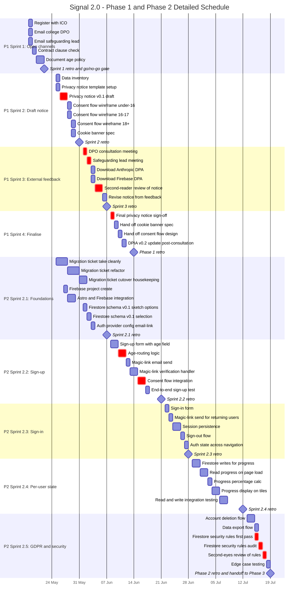

# Detailed Gantt: Phase 1 and Phase 2

**Project:** Signal Computer Misuse POC (Signal 2.0)
**Scope:** Phase 1 (Legal and admin) and Phase 2 (Auth and state)
**Duration:** 18 May 2026 to 19 July 2026 (9 weeks)
**Capacity assumption:** 1.5 effort days per week
**Last updated:** 17 May 2026
**Maintained by:** Project Manager

---

## How to read this chart

Tasks are grouped by sprint. Critical-path items (those that block downstream work or compliance) are marked `crit` and render in a different colour on GitHub. Milestones (sprint retros, go/no-go gates) appear as diamond markers. Dependencies use `after` where the chain is strict; flexible tasks use absolute dates within their sprint window.

Phase 1 runs four weekly sprints. Phase 2 runs five sprints of varying length, starting Week 2 and continuing parallel to Phase 1.

The diagram renders natively on GitHub. If viewing this file in a non-Mermaid editor, the diagram appears as code until rendered.

---

## Schedule

---

## Critical path summary

The critical path through Phase 1 and Phase 2 is:

1. **Privacy notice v0.1** (Sprint 2). Cannot start consultations without something to consult on.
2. **DPO and safeguarding consultations** (Sprint 3). Must complete before notice can be finalised.
3. **Second-reader review** (Sprint 3). Must complete before notice signs off.
4. **Final privacy notice sign-off** (Sprint 4). Closes Phase 1.
5. **Age-routing logic** (Sprint 2.2). The technical implementation of the age policy decision.
6. **Consent flow integration** (Sprint 2.2). Where Phase 1 deliverables meet Phase 2 code. Cannot complete until Sprint 4 of Phase 1 is done.
7. **Firestore security rules audit** (Sprint 2.5). Compliance gate before any UAT or production use.

Any slip on these items pushes downstream work directly. Other tasks have float and can absorb modest slips internally.

---

## Cross-phase dependency

The most fragile dependency in the schedule:

**Phase 1 Sprint 4** (consent flow design hand-off, completing 14 June) feeds **Phase 2 Sprint 2.2** (consent flow integration, ending around 21 June). Gap is one week. If Sprint 4 slips, Sprint 2.2 starts with placeholder consent design and refactors later. Acceptable for the POC but worth watching.

---

## Update protocol

- Edit this file directly when tasks shift. Mermaid syntax is documented at [mermaid.js.org/syntax/gantt.html](https://mermaid.js.org/syntax/gantt.html).
- When a task completes, append `done,` before its dependency declaration, e.g. `:done, p1s1a, 2026-05-18, 1d`.
- When a task is in progress, use `active,` in the same position.
- Add new tasks at the end of their sprint section so historical positions stay stable.
- Update the "Last updated" date at the top each time the file is committed.

---

## Linked artefacts

- [Project Charter](./project-charter.md)
- [Decision Log](./decision-log.md)
- [Risk Register](./risk-register.md)
- [DPIA](./dpia.md)
- [Migration Ticket SIGNAL2-001](./SIGNAL2-001-migration.md)

---

## Change log

| Date | Author | Change |
|---|---|---|
| 17 May 2026 | PM | Initial detailed Gantt for Phase 1 and Phase 2 |
